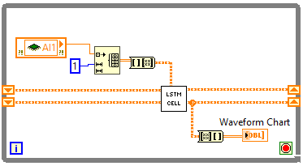
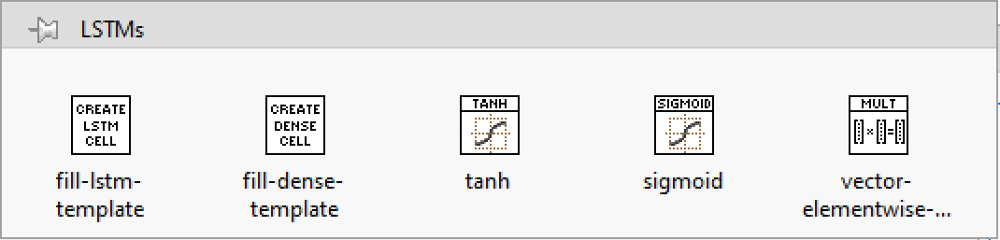

# LabVIEW-LSTM
LabVIEW library for deploying LSTMS in LabVIEW and LabVIEW Real-Time. This library lets the user upload weights to create custom LSTM cell VIs that can easily be deployed onto LabVIEW or LabVIEW Real-Time. 

   

Each LSTM VI stores its weights and performs calculations to update cell state. Time steps are implemented with shift registers within a loop.

   

Stacked LSTM sequences can be implemented by feeding the output of each LSTM layer to be the input of the next.

## How to create LSTM cell VIs
After installing the package a new palette should appear in the LabVIEW functions panel. Select "fill-lstm-template" or "fill-dense-template" depending on if you wish to make an LSTM cell or dense cell. Drag the VI to the workspace and double-click it to open the VI. Enter the name of the new cell and weight path into the appropriate fields. Run the VI and when the generated VI opens, "save as" to set the file location.

  

## Formatting .csv files
The matrices of weights for a cell should be stored in separate csv files withn a folder. Each file is named in the format "matrix" + "gate" + ".csv". Matrices are "W" (kernel), "U" (recurrent kernel), and "b" (bias). Gates are "i", "f", "c", and "o". Therefore names are Wi.csv, Uo.csv, bf.csv, etc. The python function given in ``create_weight_folder.py`` converts the weights of a keras LSTM model to this format.

## [Development workspace](development_workspace)
Houses all the code used in building and developing the functions. 

## [Package](package)
Houses the published packages. See the latest package in "Releases".

[![CC BY-SA 4.0][cc-by-sa-shield]][cc-by-sa]

This work is licensed under a
[Creative Commons Attribution-ShareAlike 4.0 International License][cc-by-sa].

[cc-by-sa]: http://creativecommons.org/licenses/by-sa/4.0/
[cc-by-sa-image]: https://licensebuttons.net/l/by-sa/4.0/88x31.png
[cc-by-sa-shield]: https://img.shields.io/badge/License-CC%20BY--SA%204.0-lightgrey.svg

Cite as:

@Misc{Coble2022LabVIEWLSTM,  
author = {Daniel Coble and Austin Downey},  
title = {{LabVIEW-LSTM}},  
year = {2022},  
groups = {{ARTS-L}ab},  
url = {https://github.com/ARTS-Laboratory/LabVIEW-LSTM},  
}

